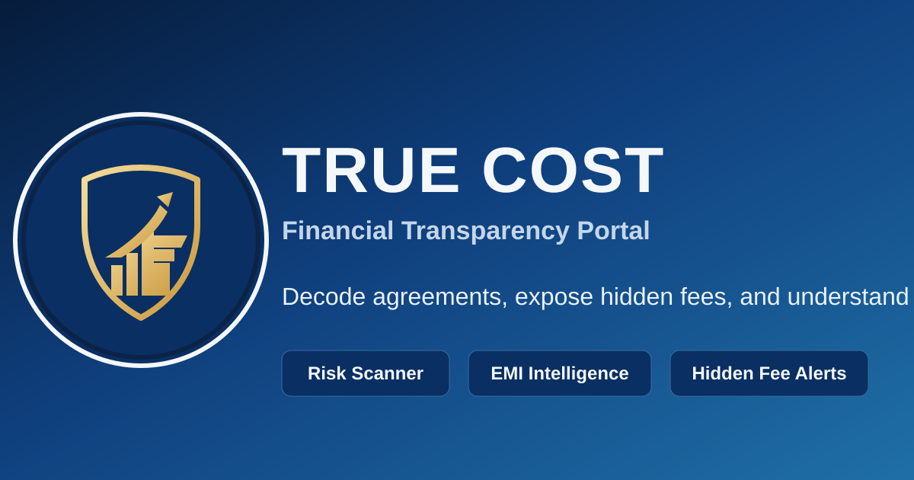

# TRUE COST

Financial clarity for real people. TRUE COST analyzes loan and credit terms, surfaces hidden fees, and shows the real repayment burden before you commit.


## What This Product Does

- 🔎 Decodes financial/legal text into plain-language risks
- 🧾 Detects hidden fees and manipulative clauses
- 📊 Computes EMI, total payment, and true interest burden
- 🛡️ Generates a risk score with recommendations
- 💱 Supports INR and USD extraction + calculations

## Visual Snapshot



## Core Experience

1. Paste agreement text on the Analyze page
2. Auto-extract amount, APR, and duration
3. Review hidden-fee flags, EMI math, and risk score
4. Explore worst-case scenarios and savings simulation
5. Compare alternatives before signing

## Run Locally

```bash
npm install
npm run dev -- --host 0.0.0.0 --port 5175
```

Open: http://localhost:5175

## Scripts

```bash
npm run dev
npm run build
npm run lint
npm run test
```

## Project Stack

- Frontend: React + TypeScript + Vite
- UI: Tailwind CSS + shadcn/ui + Framer Motion
- Logic: Local financial analysis engine (no mandatory backend)
- Testing: Vitest

## Brand Notes

TRUE COST is positioned as a trust-first financial intelligence interface:

- Clear signal over noise
- Explanations over jargon
- Defensive decision support over sales pressure
